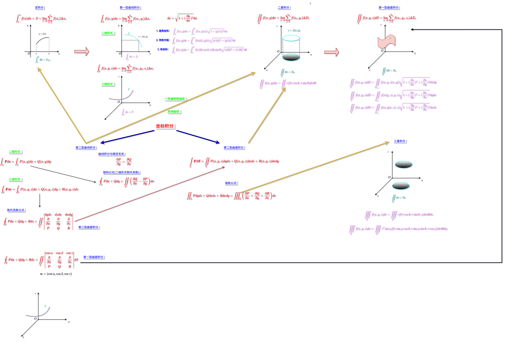

---

mindmap-plugin: basic

---

# 多元函数积分学

## 空间解析几何
### 向量代数
- 方向角: 非零向量 $\boldsymbol{a}$ 与 $x,y,z$ 轴所成夹角 $\alpha,\beta,\gamma$ 称为向量 $\boldsymbol{a}$ 的方向角
- 方向余弦: 向量 $\boldsymbol{a}$ 与 $x,y,z$ 轴的夹角余弦值 $\cos\alpha,\cos\beta,\cos\gamma$ 称为向量 $\boldsymbol{a}$ 的方向余弦, $\boldsymbol{a} = x\boldsymbol{i} + y\boldsymbol{j} + z\boldsymbol{k}$
- $$\begin{cases}
\cos\alpha = \dfrac{a_x}{|\boldsymbol{a}|} = \dfrac{x}{\sqrt{x^{2}+y^{2}+z^{2}}}\\
\cos\beta = \dfrac{a_y}{|\boldsymbol{a}|} =  \dfrac{y}{\sqrt{x^{2}+y^{2}+z^{2}}}\\
\cos\gamma = \dfrac{a_z}{|\boldsymbol{a}|} = \dfrac{z}{\sqrt{x^{2}+y^{2}+z^{2}}}
\end{cases}$$
- 夹角: 向量 $\boldsymbol{a}$ 与 $\boldsymbol{b}$ 的夹角 $\theta$ 满足 $\cos\theta = \dfrac{\boldsymbol{a}\cdot\boldsymbol{b}}{|\boldsymbol{a}||\boldsymbol{b}|}$
- 投影: $\boldsymbol{Prj}_{b}a = \dfrac{\boldsymbol{a}\cdot \boldsymbol{b}}{|\boldsymbol{b}|} = \dfrac{a_{x}b_{x}+a_{y}b_{y}+a_{z}b_{z}}{\sqrt{b_{x}^{2}+b_{y}^{2}+b_{z}^{2}}}$
- $$\boldsymbol{a}\times\boldsymbol{b} = \begin{vmatrix}
\boldsymbol{i} & \boldsymbol{j} & \boldsymbol{k}\\
a_{x} & a_{y} & a_{z}\\
b_{x} & b_{y} & b_{z}
\end{vmatrix} = (a_{y}b_{z}-a_{z}b_{y})\boldsymbol{i} - (a_{x}b_{z}-a_{z}b_{x})\boldsymbol{j} + (a_{x}b_{y}-a_{y}b_{x})\boldsymbol{k}$$
- $\boldsymbol{a}\times\boldsymbol{b}$ 的模为 $\boldsymbol{a}$ 和 $\boldsymbol{b}$ 所决定的平行四边形的面积 $\to \big|\boldsymbol{a}\times\boldsymbol{b}\big| = \boldsymbol{a}\cdot\boldsymbol{b}\sin\theta$

### 空间直线和平面
#### 平面
- 法向量 $\boldsymbol{n} = (A,B,C)$
- 一般式方程: $Ax+By+Cz+D=0$
- 点法式方程: $(x-x_0)A+(y-y_0)B+(z-z_0)C=0$
- 截距式方程: $\dfrac{x}{a}+\dfrac{y}{b}+\dfrac{z}{c}=1$
- 三点式方程: $$\begin{vmatrix}
x-x_1 & y-y_1 & z-z_1\\
x_2-x_1 & y_2-y_1 & z_2-z_1\\
x_3-x_1 & y_3-y_1 & z_3-z_1
\end{vmatrix} = 0$$
#### 直线方程
- 方向向量 $\boldsymbol{\tau} = (l,m,n)$
- 一般式方程: $$\begin{cases}
\boldsymbol{\tau} = (l,m,n) = \boldsymbol{n_{1}}\times \boldsymbol{n_{2}}\\
A_1x+B_1y+C_1z+D_1=0, \boldsymbol{n_{1}} = (A_{1},B_{1},C_{1})\\
A_2x+B_2y+C_2z+D_2=0, \boldsymbol{n_{2}} = (A_{2},B_{2},C_{2})
\end{cases}$$
- 点向式方程: $\dfrac{x-x_0}{l} = \dfrac{y-y_0}{m} = \dfrac{z-z_0}{n}$
- 参数方程: $$\begin{cases}
x = x_0+lt\\
y = y_0+mt\\
z = z_0+nt
\end{cases}$$
- 两点式方程: $\dfrac{x-x_1}{x_{1}-x_{2}} = \dfrac{y-y_1}{y_{1}-y_{2}} = \dfrac{z-z_1}{z_{1}-z_{2}}$

#### 位置关系
- 点到直线的距离
	- 二维空间: $d = \dfrac{|Ax_{0}+By_{0}+C|}{\sqrt{A^{2}+B^{2}}}$
	- 三维空间: $$d = \dfrac{\big|\boldsymbol{\tau}\times \overrightarrow{M_{0}M}\big|}{\big|\boldsymbol{\tau}\big|} = \dfrac{\left|\left|\begin{matrix}\boldsymbol{i} & \boldsymbol{j} & \boldsymbol{k} \\
	l & m & n\\
	x-x_{0} & y-y_{0} & z-z_{0}
	\end{matrix}\right|\right|}{\sqrt{l^{2}+m^{2}+n^{2}}}$$
- 点到平面的距离
	- $d = \dfrac{|Ax_{0}+By_{0}+Cz_{0}+D|}{\sqrt{A^{2}+B^{2}+C^{2}}}$
- 直线
	- 平行: $\dfrac{l_{1}}{l_{2}} = \dfrac{m_{1}}{m_{2}} = \dfrac{n_{1}}{n_{2}}$
	- 垂直: $l_{1}l_{2}+m_{1}m_{2}+n_{1}n_{2} = 0$
- 平面
	- 平行: $\boldsymbol{n_{1}} \parallel \boldsymbol{n_{2}} \to \dfrac{A_{1}}{A_{2}} = \dfrac{B_{1}}{B_{2}} = \dfrac{C_{1}}{C_{2}}$
	- 垂直: $\boldsymbol{n_{1}} \perp \boldsymbol{n_{2}} = 0 \to A_{1}A_{2} + B_{1}B_{2} + C_{1}C_{2} = 0$
### 空间曲线和曲面
#### 曲线
- 一般式方程: $$\begin{cases}
F(x,y,z) = 0\\
G(x,y,z) = 0
\end{cases}$$
- 参数方程: $$\begin{cases}
x = x(t)\\
y = y(t)\\
z = z(t)
\end{cases}$$
- 空间曲线在坐标面上的投影: $$\begin{cases}
F(x,y,z) = 0\\
G(x,y,z) = 0
\end{cases}\to \begin{cases}
H(x,y) = 0
z = 0
\end{cases}$$

#### 曲面
- 一般式方程: $F(x,y,z) = 0$
- 二次曲面
  > 椭球面: $\dfrac{x^{2}}{a^{2}}+\dfrac{y^{2}}{b^{2}}+\dfrac{z^{2}}{c^{2}} = 1$
  > 单叶双曲面: $\dfrac{x^{2}}{a^{2}}+\dfrac{y^{2}}{b^{2}}-\dfrac{z^{2}}{c^{2}} = 1$
  > 双叶双曲面: $\dfrac{x^{2}}{a^{2}}-\dfrac{y^{2}}{b^{2}}-\dfrac{z^{2}}{c^{2}} = 1$
  > 椭圆抛物面: $\dfrac{x^{2}}{a^{2}}+\dfrac{y^{2}}{b^{2}} = z$
  > 双曲抛物面: $\dfrac{x^{2}}{a^{2}}-\dfrac{y^{2}}{b^{2}} = z$
  > 椭圆锥面: $\dfrac{x^{2}}{a^{2}}+\dfrac{y^{2}}{b^{2}} = z^{2}$
  > 椭圆柱面: $\dfrac{x^{2}}{a^{2}}+\dfrac{y^{2}}{b^{2}} = 1$
  > 双曲柱面: $\dfrac{x^{2}}{a^{2}}-\dfrac{y^{2}}{b^{2}} = 1$
  > 抛物柱面: $z = x^{2}+y^{2}$
- 旋转曲面
	- 轴直线方向向量 $\boldsymbol{\tau} = (l,m,n)$, $M_{1}(x_{1},y_{1},z_{1})$ 在曲线 $\Gamma$ 上, $P$ 是纬圆上一点
		- $$\begin{cases}
		\boldsymbol{\tau} \perp \boldsymbol{n}\\
		|M_{1}M_{0}| = |M_{0}P|\\
		\boldsymbol{\tau} \perp \boldsymbol{M_{1}M_{0}}\\
		F(x_{1},y_{1},z_{1}) = 0 \\
		G(x_{1},y_{1},z_{1}) = 0
		\end{cases}$$
### 空间曲面切平面和法线

- 切平面: $F_{x}(x_{0},y_{0},z_{0})(x-x_{0})+F_{y}(x_{0},y_{0},z_{0})(y-y_{0})+F_{z}(x_{0},y_{0},z_{0})(z-z_{0}) = 0$
- 法线: $\boldsymbol{n} = \boldsymbol{guad} F\big|_{P_{0}} = (F_{x}(x_{0},y_{0},z_{0}),F_{y}(x_{0},y_{0},z_{0}),F_{z}(x_{0},y_{0},z_{0}))$

### 空间曲线切线和法平面
- 切线: $\boldsymbol{n} = (f'(t),g'(t),h'(t))$
- 法平面：$f'(t)(x-x_{0}) + g'(t)(y-y_{0}) + h'(t)(z-z_{0}) = 0$

### 场论初步
#### 方向导数

- $\dfrac{\partial u}{\partial \boldsymbol{l}}\big|_{P_{0}} = u_{x}'\cos \alpha + u_{y}'\cos\beta + u_{z}'\cos\gamma$, 其中 $\cos\alpha = \dfrac{l}{|\boldsymbol{l}|}, \cos\beta = \dfrac{m}{|\boldsymbol{l}|}, \cos\gamma = \dfrac{n}{|\boldsymbol{l}|}$

#### 梯度
- $\boldsymbol{guad} u\big|_{P_{0}} = (u_{x}'(P_{0}),u_{y}'(P_{0}),u_{z}'(P_{0}))$
- $\dfrac{\partial u}{\partial \boldsymbol{l}}\big|_{P_{0}} = \boldsymbol{guad} u\big|_{P_{0}} \cdot \boldsymbol{l} = \big|\boldsymbol{guad} u\big|_{P_{0}}\big| \big|\boldsymbol{l}\big|\cos\theta$

#### 散度和旋度
- 散度: $\nabla \cdot \boldsymbol{A} = \dfrac{\partial P}{\partial x} + \dfrac{\partial Q}{\partial y} + \dfrac{\partial R}{\partial z}$
- 旋度: $$\nabla \times \boldsymbol{A} = \begin{vmatrix}
	\boldsymbol{i} & \boldsymbol{j} & \boldsymbol{k}\\
	\dfrac{\partial}{\partial x} & \dfrac{\partial}{\partial y} & \dfrac{\partial}{\partial z}\\
	P & Q & R
	\end{vmatrix}$$

## 三重积分

### 三重积分的概念和定义

- 设 $f(x, y, z)$ 是空间有界闭区域 $\Omega$ 上的有界函数, 将 $\Omega$ 任意分为 $n$ 个小闭区域$$\Delta v_{1}, \Delta v_{2}, \cdots, \Delta v_{n}$$
其中 $\Delta v_{i}$ 表示第 $i$ 个小闭区域, 也表示第 $i$ 个小闭区域的体积, 在每一个 $\Delta v_{i}$ 中任意取一点 $(\xi_{i}, \eta_{i}, \zeta_{i})$, 作乘积 $f(\xi_{i},\eta_{i},\zeta_{i})\Delta v_{i}(i = 1,2,\cdots,n)$,并求和 $\sum_{i=1}^{n}f(\xi_{i},\eta_{i},\zeta_{i})\Delta v_{i}$, 如果当 $\lim\limits_{n \to +\infty}\{\lambda |\lambda = \max\{\Delta v_{i}\text{的直径}, i = 1,2,\cdots,n\}\} = 0$ 时, 求和的极限总是存在, 与 $\Delta v_{i}$ 的分法以及点 $(\xi_{i}, \eta_{i}, \zeta_{i})$ 的选取无关, 称此极限为函数 $f(x,y,z)$ 在闭区域 $\Omega$ 上的三重积分, 记作 $\iiint\limits_{\Omega}f(x,y,z)dv$
$$\iiint\limits_{\Omega}f(x,y,z)dv = \lim\limits_{\lambda \to 0}\sum_{i=1}^{n}f(\xi_{i},\eta_{i},\zeta_{i})\Delta v_{i}$$其中 $f(x,y,z)$ 称为被积函数, $\Omega$ 称为积分区域, $f(x,y,z)dv$ 称为被积表达式, $dv$ 称为体积微元, $x,y,z$ 称为积分变量, $\sum\limits_{i=1}^{n} f(\xi_{i},\eta_{i},\zeta_{i})\Delta v_{i}$ 称为积分和

- 物理意义：设一物体占有 $Oxyz$ 上闭区域 $\Omega$, 在点 $(x,y,z)$ 处的密度为 $\rho(x,y,z)$, 假定 $\rho(x,y,z)$ 在 $\Omega$ 上连续, 物体质量 $M = \iiint\limits_{\Omega}\rho(x,y,z)dv$

### 三重积分性质

- (1). 当 $f(x,y,z)$ 在闭区域 $\Omega$ 上连续时, 三重积分 $\iiint\limits_{\Omega}f(x,y,z)dv$ 一定存在; 当 $f(x,y,z)$ 在 $\Omega$ 上可积, $f(x,y,z)$ 在 $\Omega$ 上必有界
- (2). $\iint\limits_{\Omega}1dv = \iiint\limits_{\Omega}dv = V$, $V$ 是 $\Omega$ 的体积
- (3). 积分线性性质
$$\iiint\limits_{\Omega}\left[k_{1}f(x,y,z)\pm k_{2}g(x,y,z)\right] dv=k_{1}\iiint\limits_{\Omega}f(x,y,z)dv \pm k_{2}\iiint\limits_{\Omega}g(x,y,z)dv$$
- (4). 积分的可加性
设 $f(x,y,z)$ 在 $\Omega$ 上可积, 且 $\Omega_{1} \cap \Omega_{2} = \emptyset, \Omega_{1} \cup \Omega_{2} =\Omega$ $$\iiint\limits_{\Omega}f(x,y,z)dv = \iiint\limits_{\Omega_{1}}f(x,y,z)dv + \iiint\limits_{\Omega_{2}}f(x,y,z)dv $$
- (5). 积分保号性
设 $f(x,y,z)$ 和 $g(x,y,z)$ 在 $\Omega$ 上可积, 且在 $\Omega$ 上, $f(x,y,z)\leq g(x,y,z)$ $$\iiint\limits_{\Omega}f(x,y,z)dv \leq \iiint\limits_{\Omega}g(x,y,z)dv \Rightarrow \big|\iiint\limits_{\Omega}f(x,y,z)dv\big| \leq \iiint\limits_{\Omega}\big|f(x,y,z)\big|dv$$
- (6). 估值定理
设 $M,m$ 分别是 $f(x,y,z)$ 在 $\Omega$ 上的最大值和最小值, $V$ 是 $\Omega$ 的体积
$$mV \leq \iiint\limits_{\Omega}f(x,y,z)dv \leq MV$$
- (7). 中值定理
设 $f(x,y,z)$ 在 $\Omega$ 上连续, $V$ 是 $\Omega$ 的体积 $$\exists (\xi,\eta,\zeta) \in \Omega,\ s.t.\ \iiint\limits_{\Omega}f(x,y,z)dv = f(\xi,\eta,\zeta)V $$

### 三重积分对称性

- (1). $\Omega$ 关于平面 $xoz$ 对称 $$\iiint\limits_{\Omega}f(x,y,z)dv =
\begin{cases}
2\iiint\limits_{\Omega_{1}}f(x,y,z)dv & f(x,y,z) = f(x,-y,z)\\
0                                     & f(x,y,z) = -f(x,-y,z)
\end{cases}$$
- (2). $\Omega$ 关于平面 $yoz$ 对称 $$\iiint\limits_{\Omega}f(x,y,z)dv =
\begin{cases}
2\iiint\limits_{\Omega_{1}}f(x,y,z)dv & f(x,y,z) = f(-x,y,z)\\
0                                     & f(x,y,z) = -f(-x,y,z)
\end{cases}$$
- (3). $\Omega$ 关于平面 $xoy$ 对称 $$\iiint\limits_{\Omega}f(x,y,z)dv =
\begin{cases}
2\iiint\limits_{\Omega_{1}}f(x,y,z)dv & f(x,y,z) = f(x,y,-z)\\
0                                     & f(x,y,z) = -f(x,y,-z)
\end{cases}$$
- 轮换对称性：若将 $x,y,z$ 任意两个交换位置后, 积分区域 $\Omega$ 保持不变 $$\iiint\limits_{\Omega}f(x)dv=\iiint\limits_{\Omega}f(y)dv=\iiint\limits_{\Omega}f(z)dv$$

### 三重积分的计算

- $$\iiint\limits_{\Omega}f(x,y,z)dv=\iint\limits_{D_{xy}}d\sigma \int_{z_{1}(x,y)}^{z_{2}(x,y)}f(x,y,z)dz$$ 一般用于空间区域 $\Omega$ 无侧面或者侧面为柱面, 转化为二重积分, 积分区域为空间区域 $\Omega$ 在 $xoy(yoz,xoz)$ 平面的投影
- $$\iiint\limits_{\Omega}f(x,y,z)dv = \int_{a}^{b}dz\iint\limits_{D_{z}}f(x,y,z)d\sigma$$ 适用于旋转体, 旋转曲面方程 $z = z(x,y)$
- 换元法：令 $$\begin{cases}
x = x(u,v,w) \\
y = y(u,v,w) \\
z = z(u,v,w)
\end{cases}$$, 且 $(x,y,z)\to (u,v,w)$ 是一一映射, $x = x(u,v,w), y = y(u,v,w), z = z(u,v,w)$ 有一阶连续偏导数
$$\begin{vmatrix}
\dfrac{\partial (x,y,z)}{\partial (u,v,w)}
\end{vmatrix} =
\begin{Vmatrix}
\dfrac{\partial x}{\partial u} & \dfrac{\partial x}{\partial v} & \dfrac{\partial x}{\partial w} \\
\dfrac{\partial y}{\partial u} & \dfrac{\partial y}{\partial v} & \dfrac{\partial y}{\partial w} \\
\dfrac{\partial z}{\partial u} & \dfrac{\partial z}{\partial v} & \dfrac{\partial z}{\partial w}
\end{Vmatrix}\neq 0$$
$$\iiint\limits_{\Omega_{xyz}}f(x,y,z)dxdydz = \iiint\limits_{\Omega_{uvw}}f \left[x(u,v,w), y(u,v,w), z(u,v,w)\right]
\begin{vmatrix}
\dfrac{\partial (x,y,z)}{\partial (u,v,w)}
\end{vmatrix}
dudvdw$$
- $$\iiint\limits_{\Omega_{xyz}}f(x,y,z)dxdydz=\iint\limits_{\Omega_{r\theta z}}drd\theta \int_{z_{1}(r,\theta)}^{z_{2}(r,\theta)}rf(r\cos \theta,r\sin\theta,z)dz$$
- $$\iiint\limits_{\Omega_{xyz}}f(x,y,z)dxdydz=\iiint\limits_{\Omega_{r\varphi\theta}}r^2\sin\varphi f(r\sin\varphi\cos\theta,r\sin\varphi\sin\theta,r\cos\varphi) drd\theta d\varphi$$

## 第一型曲线和曲面积分

### 第一型曲线积分

#### 第一型曲线积分概念和定义
- 设 $L$ 是 $xoy$ 平面内一条光滑曲线弧, 函数 $f(x,y)$ 在 $L$ 上有界, 在 $L$ 上任意插入一系列的点 $M_{1}, M_{2}, \cdots, M_{n-1}$ 将 $L$ 分成 $n$ 小段, 设第 $i$ 段的弧长为 $\Delta s_{i}$, 在 第 $i$ 段上任意取一点 $(\zeta_{i},\eta_{i})$, 作乘积 $f(\zeta_{i},\eta_{i})\Delta s_{i}(i=1,2,\cdots,n)$, 并求和 $\sum\limits_{i=1}^{n}f(\zeta_{i},\eta_{i})\Delta s_{i}$, 当 $\lim\limits_{n \to +\infty}\{\lambda|\lambda = \max\{\Delta s_{i}\}, i =1,2,\cdots,n\} = 0$ 时, 求和极限存在, 且与 $\Delta s_{i}$ 的分法以及 $(\zeta_{i},\eta_{i})$ 的取法无关, 称此极限为函数 $f(x,y)$ 在曲线 $L$ 上对弧长的曲线积分或第一型曲线积分, 记作 $\int_{L}f(x,y)ds$ $$\int_{L}f(x,y)ds = \lim\limits_{\lambda \to 0}\sum\limits_{i=1}^{n}f(\zeta_{i},\eta_{i})\Delta s_{i}$$ 其中 $f(x,y)$ 称为被积函数, $f(x,y)ds$ 称为被积表达式, $x,y$ 是积分变量, $L$ 是积分弧 对于函数 $f(x,y,z)$ 在空间曲线 $\Gamma$ 上的第一型曲线积分 $$\int_{\Gamma}f(x,y,z)ds = \lim\limits_{\lambda \to 0}\sum\limits_{i=1}^{n}f(\xi_{i},\eta_{i},\zeta_{i})\Delta s_{i}$$
- 物理意义
	- 1. 设一物体在 $xoy$ 平面内一光滑曲线弧 $L$ 上, 物体在 $L$ 上的线密度为 $\rho(x,y)$, 则物体的质量 $m = \int_{L}\rho(x,y)ds$
	- 2. 设一物体在空间曲线 $\Gamma$ 上, 物体在 $\Gamma$ 上的线密度为 $\rho(x,y,z)$, 则物体的质量 $m = \int_{\Gamma}\rho(x,y,z)ds$

#### 第一型曲线积分性质
- (1). $\displaystyle{\int_{\Gamma} ds = l_{\Gamma}}$, 其中 $l_{\Gamma}$ 是 $\Gamma$ 的长度
- (2). 设 $f(x,y,z)$ 在 $\Gamma$ 上可积, 其在 $\Gamma$ 上必有界
- (3). 积分线性性质 $$\int_{\Gamma}\left[k_{1}f(x,y,z) + k_{2} g(x,y,z)\right]ds = k_{1}\int_{\Gamma}f(x,y,z)ds+k_{2}\int_{\Gamma}g(x,y,z)ds$$
- (4). 积分可加性 设 $f(x,y,z)$ 在 $\Gamma$ 上可积, 且 $\Gamma_{1}\cap \Gamma_{2}=\emptyset, \Gamma_{1}\cup \Gamma_{2}=\Gamma$ $$\int_{\Gamma}f(x,y,z)ds = \int_{\Gamma_{1}}f(x,y,z)ds + \int_{\Gamma_{2}}f(x,y,z)ds$$
- (5). 积分保号性 设 $f(x,y,z), g(x,y,z)$ 在 $\Gamma$ 上可积, 且在 $\Gamma$ 上 $f(x,y,z) \leq g(x,y,z)$ $$\int_{\Gamma}f(x,y,z)ds \leq \int_{\Gamma}g(x,y,z)ds\Rightarrow \big|\int_{\Gamma}f(x,y,z)ds\big| \leq \int_{\Gamma}\big|f(x,y,z)\big|ds$$
- (6). 估值定理 设 $M,m$ 分别是 $f(x,y,z)$ 在 $\Gamma$ 上的最大值和最小值, $l_{\Gamma}$ 的长度 $$ml_{\Gamma} \leq \int_{\Gamma}f(x,y,z)ds \leq Ml_{\Gamma}$$
- (7). 中值定理 设 $f(x,y,z)$ 在 $\Gamma$ 上连续, $l_{\Gamma}$ 是 $\Gamma$ 的长度 $$\exists (\xi,\eta,\zeta)\in \Gamma,\ s.t.\ \int_{\Gamma}f(x,y,z) ds = f(\xi,\eta,\zeta)l_{\Gamma}$$

#### 第一型曲线积分的计算
- 平面计算
- (1). $L: y=f(x), x\in[a,b]$ $$\int_{L}f(x,y)ds=\int_{a}^{b}f(x,y)\sqrt{1+[f'(x)]^2}dx$$
- (2). $$L: \begin{cases}
x = x(t)\\
y = y(t)
\end{cases} t\in[\alpha,\beta] \Rightarrow \int_{L}f(x,y)ds=\int_{\alpha}^{\beta}f\left[x(t),y(t)\right]\sqrt{[x'(t)]^2+[y'(t)]^2}dt$$
- (3). $L: r=r(\theta), \theta\in[\theta_{1},\theta_{2}]$ $$\int_{L}f(x,y)ds=\int_{\theta_{1}}^{\theta_{2}}f(r\cos \theta,r\sin\theta)\sqrt{[r(\theta)]^2+[r'(\theta)]^2}d\theta$$
- 空间计算
- $$\begin{cases}
x = x(t)\\
y = y(t)\\
z = z(t)
\end{cases} t\in[\alpha,\beta]\Rightarrow
ds=\sqrt{[x'(t)]^{2}+[y'(t)]^{2}+[z'(t)]^{2}}dt$$
- $$\int_{\Gamma}f(x,y,z)ds=\int_{\alpha}^{\beta}f \left[ x(t),y(t),z(t)\right]\sqrt{[x'(t)]^{2}+[y'(t)]^{2}+[z'(t)]^{2}}dt$$
  
### 第一型曲面积分

#### 第一型曲面积分概念和定义

- 设曲面 $\Sigma$ 是光滑的, 函数 $f(x,y,z)$ 在 $\Sigma$ 上有界, 将 $\Sigma$ 任意分为 $n$ 个小块 $\Delta \Sigma_{i}$, $\Delta S_{i}$ 表示曲面 $\Delta\Sigma_{i}$ 的面积, 在 $\Delta\Sigma_{i}$ 上任意取一点 $(\xi_{i},\eta_{i},\zeta_{i})$, 作乘积 $f(\xi_{i},\eta_{i},\zeta_{i})\Delta S_{i}(i=1,2,\cdots,n)$, 并求和 $\sum\limits_{i=1}^{n}f(\xi_{i},\eta_{i},\zeta_{i})S_{i}$, 当 $\lim\limits_{n \to +\infty}\{\lambda|\lambda = \max\{S_{i}\}, i =1,2,\cdots,n\} = 0$ 时, 极限 $\lim\limits_{\lambda \to 0}\sum\limits_{i=1}^{n}f(\xi_{i},\eta_{i},\zeta_{i})\Delta S_{i}$ 存在, 且与 $\Delta\Sigma_{i}$ 的分法和 $(\xi_{i},\eta_{i},\zeta_{i})$ 的取法无关, 称此极限为函数 $f(x,y,z)$ 在曲面 $\Sigma$ 上对面积的曲面积分或第一型曲面积分, 记作 $\iint\limits_{\Sigma}f(x,y,z)dS$
$$\iint\limits_{\Sigma}f(x,y,z)dS = \lim\limits_{\lambda \to 0}\sum\limits_{i=1}^{n}f(\xi_{i},\eta_{i},\zeta_{i})\Delta S_{i}$$
其中 $f(x,y,z)$ 称为被积函数, $f(x,y,z)dS$ 称为被积表达式, $x,y,z$ 是积分变量, $\Sigma$ 是积分曲面
- 物理意义：设一曲面物体 $\Sigma$, 曲面密度为 $\rho(x,y,z)$, 则物体的质量 $m = \iint\limits_{\Sigma}\rho(x,y,z)dS$

#### 第一型曲面积分性质

- (1). $\displaystyle{\int_{\Sigma} dS = S}$, 其中 $S$ 是 $\Sigma$ 的面积
- (2). 设 $f(x,y,z)$ 在 $\Sigma$ 上可积, 其在 $\Sigma$ 上必有界
- (3). 积分线性性质
$$\iint\limits_{\Sigma}\left[k_{1}f(x,y,z) + k_{2} g(x,y,z)\right]dS = k_{1}\iint\limits_{\Sigma}f(x,y,z)dS+k_{2}\iint\limits_{\Sigma}g(x,y,z)dS$$
- (4). 积分可加性
设 $f(x,y,z)$ 在 $\Sigma$ 上可积, 且 $\Sigma_{1}\cap \Sigma_{2}=\emptyset, \Sigma_{1}\cup \Sigma_{2}=\Sigma$
$$\iint\limits_{\Sigma}f(x,y,z)dS = \iint\limits_{\Sigma_{1}}f(x,y,z)dS + \iint\limits_{\Sigma_{2}}f(x,y,z)dS$$
- (5). 积分保号性
设 $f(x,y,z), g(x,y,z)$ 在 $\Sigma$ 上可积, 且在 $\Sigma$ 上 $f(x,y,z) \leq g(x,y,z)$
$$\iint\limits_{\Sigma}f(x,y,z)dS \leq \iint\limits_{\Sigma}g(x,y,z)dS\Rightarrow
\big|\iint\limits_{\Sigma}f(x,y,z)dS\big| \leq \iint\limits_{\Sigma}\big|f(x,y,z)\big|dS$$
- (6). 估值定理
设 $M,m$ 分别是 $f(x,y,z)$ 在 $\Sigma$ 上的最大值和最小值, $S_{\Sigma}$ 表示 $\Sigma$ 的面积
$$mS_{\Sigma} \leq \iint\limits_{\Sigma}f(x,y,z)dS \leq MS_{\Sigma}$$
- (7). 中值定理
设 $f(x,y,z)$ 在 $\Sigma$ 上连续, $S_{\Sigma}$ 是 $\Sigma$ 的面积
$$\exists (\xi,\eta,\zeta)\in \Sigma,\ s.t.\ \iint\limits_{\Sigma}f(x,y,z) dS = f(\xi,\eta,\zeta)S_{\Sigma}$$

#### 第一型曲面积分的计算
- $$\iint\limits_{\Sigma}f(x,y,z)dS = \iint\limits_{D}f(x,y,z(x,y))\sqrt{1+\left(\dfrac{\partial z}{\partial x}\right)^{2}+\left(\dfrac{\partial z}{\partial y}\right)^{2}}dxdy$$
- $$\iint\limits_{\Sigma}f(x,y,z)dS = \iint\limits_{D}f(x(y,z),y,z)\sqrt{1+\left(\dfrac{\partial x}{\partial y}\right)^{2}+\left(\dfrac{\partial x}{\partial z}\right)^{2}}dydz$$
- $$\iint\limits_{\Sigma}f(x,y,z)dS = \iint\limits_{D}f(x,y(x,z),z)\sqrt{1+\left(\dfrac{\partial y}{\partial x}\right)^{2}+\left(\dfrac{\partial y}{\partial z}\right)^{2}}dxdz$$

## 第二型曲线和曲面积分
### 第二型曲线积分

#### 第二型曲线积分概念和定义

- 质点在一个变力场, 在变力 $\boldsymbol{F}(x,y) = P(x,y)\boldsymbol{i} + Q(x,y)\boldsymbol{j}$ 作用下沿曲线 $L$ 从点 $A$ 运动到点 $B$ 所做的功
$$W = \int_{L} dW = \int_{L}\boldsymbol{F}(x,y)\cdot d\boldsymbol{s} = \int_{L}P(x,y)dx + Q(x,y)dy$$

#### 第二型曲线积分性质

- (1). 线性性质
$$\int_{\Gamma}(k_{1}\boldsymbol{F_{1}}\pm \boldsymbol{F_{2}})d\boldsymbol{s} = k_{1}\int_{\Gamma}\boldsymbol{F_{1}}d\boldsymbol{s} + k_{2}\int_{\Gamma}\boldsymbol{F_{2}}d\boldsymbol{s}$$
- (2). 积分有向性
$$\int_{\mathop{AB}\limits^{\frown}}\boldsymbol{F}d\boldsymbol{s} = - \int_{\mathop{BA}\limits^{\frown}}\boldsymbol{F}d\boldsymbol{s}$$
- (3). 积分可加性
$$\int_{\mathop{AB}\limits^{\frown}}\boldsymbol{F}d\boldsymbol{s} = \int_{\mathop{AC}\limits^{\frown}}\boldsymbol{F}d\boldsymbol{s} + \int_{\mathop{CB}\limits^{\frown}}\boldsymbol{F}d\boldsymbol{s}$$

#### 第二型曲线积分的计算
- $$\int_{\Gamma} P(x,y)dx + Q(x,y)dy = \int_{\alpha}^{\beta}P(x(t),y(t))x'(t)dt + Q(x(t),y(t))y'(t)dt$$
- $$\oint_{\Gamma}Pdx+Qdy = \iint_{D} (\dfrac{\partial Q}{\partial x} - \dfrac{\partial P}{\partial y})dxdy$$
- $$\oint_{\Gamma}Pdx+Qdy+Rdz = \iint\limits_{\Sigma}\begin{vmatrix} dydz & dzdx & dxdy\\
\dfrac{\partial}{\partial x} & \dfrac{\partial}{\partial y} & \dfrac{\partial}{\partial z}\\
P & Q & R \end{vmatrix}$$
- $$\oint_{\Gamma}Pdx+Qdy+Rdz = \iint\limits_{\Sigma}\begin{vmatrix} \cos\alpha & \cos \beta & \cos \gamma\\
\dfrac{\partial}{\partial x} & \dfrac{\partial}{\partial y} & \dfrac{\partial}{\partial z}\\
P & Q & R \end{vmatrix}dS$$

### 第二型曲面积分
#### 第二型曲面积分概念和定义
- 向量函数 $\boldsymbol{F}(x,y,z) = P(x,y,z) \boldsymbol{i} + Q(x,y,z) \boldsymbol{j} + R(x,y,z) \boldsymbol{k}$, 向量函数 $\boldsymbol{F}$ 通过曲面 $\Sigma$ 的通量
$$\iint\limits_{\Sigma} \boldsymbol{F}\cdot \boldsymbol{n}dS$$

#### 第二型曲面积分性质
- (1). 线性性质
$$\int_{\Sigma}(k_{1}\boldsymbol{F_{1}}\pm \boldsymbol{F_{2}})d\boldsymbol{S} = k_{1}\int_{\Sigma}\boldsymbol{F_{1}}d\boldsymbol{S} + k_{2}\int_{\Sigma}\boldsymbol{F_{2}}d\boldsymbol{S}$$
- (2). 有向性
$$\int_{\Sigma^{+}}\boldsymbol{F}d\boldsymbol{S} = - \int_{\Sigma^{-}}\boldsymbol{F}d\boldsymbol{S}$$
- (3). 可加性
$$\int_{\Sigma}\boldsymbol{F}d\boldsymbol{S} = \int_{\Sigma_{1}}\boldsymbol{F}d\boldsymbol{S} + \int_{\Sigma_{2}}\boldsymbol{F}d\boldsymbol{S}$$
#### 第二型曲面积分的计算
- $$\iint\limits_{\Sigma}Pdydz+Qdxdz+Rdxdy = \iiint\limits_{\Omega}\left(\dfrac{\partial P}{\partial x}+\dfrac{\partial Q}{\partial y}+\dfrac{\partial R}{\partial z}\right)dv$$
