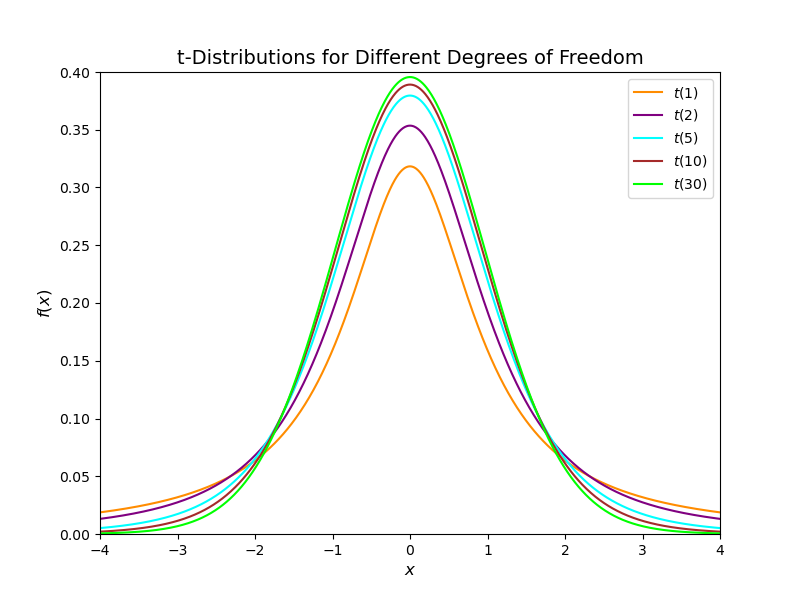

---

mindmap-plugin: basic

---
# 数理统计

## 1. 总体和样本
### 1.1 统计概念和统计量
- **总体**: 研究对象的全体称为总体
- **样本**: $n$ 个相互独立且与总体具有相同概率分布的随机变量 $X_{1}, X_{2}, \cdots, X_{n}$ 所组成的整体, $(X_{1}, X_{2}, \cdots, X_{n})$ 称为来自总体 $X$, 容量为 $n$ 的一个**简单随机样本**, 一次抽样结果的具体的 $n$ 个数值 $(x_{1},x_{2},\cdots,x_{n})$ 称为样本 $(X_{1},X_{2},\cdots,X_{n})$ 的一个观测值

- **样本分布**: 假设总体的分布函数 $F(x)$, 概率密度函数 $f(x)$, 样本 $(X_{1},X_{2},\cdots,X_{n})$ 的分布函数和概率密度
    - 离散型 $P\{X_{1} = x_{1}, X_{2} = x_{2}, \cdots, X_{n} = x_{n}\} = \prod\limits_{i = 1}^{n}P\{X_{i} = x_{i}\}$ 
    - 连续型 
    $$\begin{cases}
        F(x_{1},x_{2},\cdots,x_{n}) = \prod\limits_{i = 1}^{n}F(x_{i})\\
        f(x_{1},x_{2},\cdots,x_{n}) = \prod\limits_{i = 1}^{n}f(x_{i})
    \end{cases}$$

### 1.2 统计量及其分布
- 设 $X_{1},X_{2},\cdots,X_{n}$ 是来自总体 $X$ 的一个样本, $g(x_{1}, x_{2}, \cdots, x_{n})$ 是 $n$ 元函数, 如果函数 $g$ 中不含任何参数, 称 $g(X_{1},X_{2},\cdots,X_{n})$ 是样本 $X_{1},X_{2},\cdots,X_{n}$ 的一个**统计量**

#### 1.2.1 样本数字特征
- **样本均值** $\overline{X} = \dfrac{1}{n}\sum\limits_{i = 1}^{n}X_{i}$
- **样本方差** $S^{2} =\dfrac{1}{n-1}\sum\limits_{i = 1}^{n}(X_{i}-\overline{X})^2$
- **样本标准差** $S = \sqrt{\dfrac{1}{n-1}\sum\limits_{i = 1}^{n}(X_{i} - \overline{X})^{2}}$
- **样本 $k$ 阶原点矩**  $A_{k} = \dfrac{1}{n}\sum\limits_{i = 1}^{n}X_{i}^{k} (k = 1,2,\cdots)$
- **样本 $k$ 阶中心矩** $B_{k} = \dfrac{1}{n}\sum\limits_{i = 1}^{n}(X_{i}-\overline{X})^{k} (k = 2, 3, \cdots)$

#### 1.2.2 顺序统计量
将样本 $X_{1}, X_{2}, \cdots, X_{n}$ 的 $n$ 个观测值\textbf{从小到大}顺序排序 
$$X_{(1)} \leq X_{(2)} \leq \cdots \leq X_{(n)}\leq$$

随机变量 $X_{(k)}$ 称作第 $k$ 顺序统计量, $X_{(1)}$ 为最小顺序统计量, $X_{(n)}$为最大顺序统计量

$$\begin{cases}
    X_{(1)} = \min\{X_{1},X_{2},\cdots,X_{n}\}\\
    X_{(n)} = \max\{X_{1},X_{2},\cdots,X_{n}\}
\end{cases}$$

#### 1.2.3 统计量(数字特征)性质
假设总体期望 $E(X)=\mu$, 总体方差为 $D(X) = \sigma^{2}$, $X_{1},X_{2},\cdots,X_{n}$ 是取自总体的一个样本, $\overline{X},S^{2}$ 分别为样本的均值和方差 

- $E(X_{i}) = \mu$
- $D(X_{i}) = \sigma^{2}$
- $E(\overline{X}) = E(\dfrac{X_{1}+X_{2}+\cdots+X_{n}}{n}) = E(X) = \mu$
- $D(\overline{X}) = D(\dfrac{X_{1}+X_{2}+\cdots+X_{n}}{n}) = \dfrac{1}{n}\sigma^{2}$
- $E(S^{2}) = D(X) = \sigma^{2}$

## 2. 三大分布

### 2.1 $\chi^{2}$ 分布

随机变量 $X_{1},X_{2},\cdots,X_{n}$ 相互独立, 且都服从标准正态分布, 随机变量 $X = \sum\limits_{i = 1}^{n}X_{i}^2$ 
服从自由度为 $n$ 的卡方分布 $\chi^2(n)$, 记作 $X\sim \chi^2(n)$

**上 $\alpha$ 分位数**: 对于给定的 $\alpha (0 < \alpha < 1)$, 称满足

$$P\{\chi^{2} > \chi_{\alpha}^{2}(n)\} = \int_{\chi_{\alpha}^{2}(n)}^{+\infty}f(x)dx = \alpha$$

的 $\chi_{\alpha}^{2}(n)$ 为 $\chi^2(n)$ 分布的上 $\alpha$ 分位数

- $X_{1}\sim \chi^{2}(n_{1}), X_{2}\sim \chi^{2}(n_{2}), X_{1},X_{2}$ 相互独立, $X_{1} + X_{2}\sim \chi^{2}(n_{1}+n_{2})$
- $X\sim \chi^2(n)\Rightarrow E(X) = n, D(X) = 2n$

### 2.2 $t$ 分布

随机变量 $X\sim N(0,1), Y\sim \chi^{2}(n), X, Y$ 相互独立, 随机变量 $t = \dfrac{X}{\sqrt{Y/n}}$ 服从自由度为 $n$ 的 $t$ 分布, 记作 $t\sim t(n)$

**上 $\alpha$ 分位数**: 对于给定的 $\alpha (0 < \alpha < 1)$, 称满足
$$P\{t > t_{\alpha}(n)\} = \alpha$$
的 $t_{\alpha}(n)$ 为 $t$ 分布的上 $\alpha$ 分位数

- $t$ 分布概率密度关于 $x = 0$ 对称 $\Rightarrow E(t) = 0$
- $P\{t > - t_{\alpha}(n)\} = P\{t > t_{1-\alpha}(n)\} \Rightarrow t_{1-\alpha}(n) = -t_{\alpha}(n)$

### 2.3 $F$ 分布

随机变量 $X\sim \chi^2(n_{1}), Y\sim \chi^2(n_{2})$, 且 $X,Y$ 相互独立,随机变量 $F = \dfrac{X/n_{1}}{Y/n_{2}}$ 服从自由度为 $(n_{1},n_{2})$ 的 $F$ 分布, 记作 $F\sim F(n_{1},n_{2})$

- $F\sim F(n_{1},n_{2})\Rightarrow \dfrac{1}{F}\sim F(n_{2},n_{1})$
- $F_{1-\alpha}(n_{1},n_{2})=\dfrac{1}{F_{\alpha}(n_{2},n_{1})}$
- $t\sim t(n)\Rightarrow t^{2}\sim F(1,n)$

### 2.4 正态总体推论

设 $X_{1}, X_{2}, \cdots, X_{n}$ 是来自正态总体 $N(\mu,\sigma^{2})$ 的一个样本, $\overline{X}, S^2$ 分别是样本的均值和方差
- $\overline{X}\sim N(\mu,\dfrac{\sigma^2}{n})\Rightarrow \dfrac{\overline{X}-\mu}{\dfrac{\sigma}{\sqrt{n}}}=\dfrac{\sqrt{n}(\overline{X}-\mu)}{\sigma}\sim N(0,1)$

- $\dfrac{1}{\sigma^{2}}\sum\limits_{i=1}^{n}(X_{i}-\mu)^{2}\sim \chi^{2}(n)$

- $\dfrac{(n-1)S^2}{\sigma^2}=\sum\limits_{i=1}^{n}(\dfrac{X_{i}-\overline{X}}{\sigma})^2\sim \chi^2(n-1)$

- $\overline{X}$ 和 $S^{2}$ 相互独立 $\Rightarrow \dfrac{\sqrt{n}(\overline{X}-\mu)}{S}\sim t(n-1)$

- $\sigma$ 未知时, $\dfrac{n(\overline{X}-\mu)^2}{S^2}\sim F(1,n-1)$

## 3. 参数的点估计

设总体 $X$ 的分布函数 $F(x;\theta)$, 其中 $\theta$ 是一个未知参数, $X_{1},X_{2},\cdots,X_{n}$ 是来自总体的一个样本, 由样本构造一个适当的统计量 $\hat{\theta}(X_{1},X_{2},\cdots,X_{n})$ 作为参数 $\theta$ 的估计, 称统计量 $\hat{\theta}$ 为参数 $\theta$ 的估计量

### 3.1 矩估计
设总体分布中有 $k$ 个未知的参数 $\theta_{1},\theta_{2},\cdots,\theta_{k}$, 来自总体 $X$ 的一组样本 $X_{1},X_{2},\cdots,X_{n}$, 如果 $X$ 的原点矩 $E(X^{l})(l = 1, 2, \cdots, k)$ 存在, 样本原点矩 $\dfrac{1}{n}\sum\limits_{i=1}^{n}X_{i}^{l}$ 可作为 $E(X^{l})$ 的估计

### 3.2 最大似然估计
对未知参数 $\theta$ 进行估计, 在该参数可能的取值范围 $I$ 中选取, 使用使样本观测值 $x_{1},x_{2},\cdots,x_{n}$ 最大的参数 $\hat{\theta}$ 作为参数 $\theta$ 的估计值

似然函数 
$$\begin{cases}
    L(\theta) = L(x_{1},x_{2},\cdots,x_{n};\theta)\\
    L(\theta) = \prod\limits_{i=1}^{n}f(x_{i};\theta)
\end{cases}$$

$$\exists \hat{\theta}\in I,\ s.t.\ L(x_{1},x_{2},\cdots,x_{n},\hat{\theta}) = \max_{\theta\in I}L(x_{1},x_{2},\cdots,x_{n},\theta)$$

### 3.3 估计量评价标准

- **无偏性**: $E(\hat{\theta}) = \theta$
- **有效性**: $D(\hat{\theta})$ 最小
- **一致性**: $\forall \varepsilon > 0, \lim\limits_{n\Rightarrow \infty}P\{|\hat{\theta}-\theta|<\varepsilon\} = 1$

## 4. 参数的区间估计

### 4.1 区间估计和置信区间
设 $\theta$ 是总体 $X$ 的一个未知参数, 对于给定的 $\alpha(0 < \alpha < 1)$, 如果由样本 $X_{1},X_{2},\cdots,X_{n}$ 确定的两个统计量 $\hat{\theta_{1}} = \hat{\theta_{1}}(X_{1},X_{2},\cdots,X_{n})$ 和 $\hat{\theta_{2}} = \hat{\theta_{2}}(X_{1},X_{2},\cdots,X_{n})$ 满足 
$$P\{\hat{\theta_{1}}(X_{1},X_{2},\cdots,X_{n}) < \theta < \hat{\theta_{2}}(X_{1},X_{2},\cdots,X_{n})\} = 1-\alpha$$

则称随机区间 $(\hat{\theta_{1}},\hat{\theta_{2}})$ 是 $\theta$ 的置信度为 $1-\alpha$ 的 **置信区间**, $\hat{\theta_{1}}$ 和 $\hat{\theta_{2}}$ 分别称为 **置信上限**和 **置信下限**, $1-\alpha$ 为置信水平, $\alpha$ 为**显著性水平**

### 4.2 正态总体的置信区间

| 待估参数     | 其他参数          | 枢轴量分布                                                   | 置信区间                                                     |
| ------------ | ----------------- | ------------------------------------------------------------ | ------------------------------------------------------------ |
| $\mu$        | $\sigma^{2}$ 已知 | $Z=\dfrac{\overline{X}-\mu}{\sigma/\sqrt{n}}\sim N(0,1)$     | $\left( \overline{X}-\dfrac{\sigma}{\sqrt{n}}z_{\alpha/2},\overline{X}+\dfrac{\sigma}{\sqrt{n}}z_{\alpha/2}\right)$ |
| $\mu$        | $\sigma^{2}$ 未知 | $t=\dfrac{\overline{X}-\mu}{S/\sqrt{n}}\sim t(n-1)$          | $\left( \overline{X}-\dfrac{S}{\sqrt{n}}t_{\alpha/2}(n-1),\overline{X}+\dfrac{S}{\sqrt{n}}t_{\alpha/2}(n-1)\right)$ |
| $\sigma^{2}$ | $\mu$ 已知        | $\chi^{2}=\dfrac{\sum\limits_{i=1}^{n}(X_{i}-\mu)^{2}}{\sigma^{2}}\sim \chi^{2}(n)$ | $\left( \dfrac{\sum\limits_{i=1}^{n}(X_{i}-\mu)^{2}}{\chi_{\alpha/2}(n)},\dfrac{\sum\limits_{i=1}^{n}(X_{i}-\mu)^{2}}{\chi_{1-\alpha/2}(n)}\right)$ |
| $\sigma^{2}$ | $\mu$ 未知        | $\chi^{2}=\dfrac{(n-1)S^{2}}{\sigma^{2}}\sim \chi^{2}(n-1) $ | $\left( \dfrac{(n-1)S^{2}}{\chi_{\alpha/2}^{2}(n)},\dfrac{(n-1)S^{2}}{\chi_{1-\alpha/2}^{2}(n)}\right)$ |

## 5. 假设检验

### 5.1 统计性检验和两类错误
- $H_{0}$: 虚无假设
- $H_{1}$: 备择假设

- **第一类错误**: 虚无假设 $H_{0}$ 为真, 但拒绝了 $H_{0}$, 误认为备择假设 $H_{1}$ 为真, 犯第一类错误概率 $\alpha = P\{R(H_{0})\big| T(H_{0})\}$
- **第二类错误**: 备择假设 $H_{1}$ 为真, 但接受了 $H_{0}$, 误认为虚无假设 $H_{0}$ 为真, 犯第二类错误概率 $\beta = P\{A(H_{0})\big| T(H_{1})\}$

### 5.2 正态总体下的六大检查和拒绝域

- $\sigma^{2}$ 已知,$\mu$ 未知, $H_{0}:\ \mu = \mu_{0}, H_{1}:\ \mu \neq \mu_{0}$
	$$\mu_{r}\in (-\infty,\mu_{0}-\frac{\sigma}{\sqrt{n}}z_{\frac{\alpha}{2}})\cup (\mu_{0}+\frac{\sigma}{\sqrt{n}}z_{\frac{\alpha}{2}},+\infty)$$
	
- $\sigma^{2}$ 未知, $\mu$ 未知, $H_{0}:\ \mu = \mu_{0}, H_{1}:\ \mu\neq \mu_{0}$
	$$\mu_{r}\in (-\infty,\mu_{0}-\frac{S}{\sqrt{n}}t_{\frac{\alpha}{2}}(n-1))\cup (\mu_{0}+\frac{S}{\sqrt{n}}t_{\frac{\alpha}{2}}(n-1),+\infty)$$
	
- $\sigma^{2}$ 已知, $\mu$ 未知, $H_{0}:\ \mu\leq \mu_{0}, H_{1}:\ \mu > \mu_{0}$
	$$\mu_{r}\in (\mu_{0} + \frac{\sigma}{\sqrt{n}}z_{\alpha},+\infty)$$
	
- $\sigma^{2}$ 已知, $\mu$ 未知, $H_{0}:\ \mu\geq \mu_{0}, H_{1}:\ \mu < \mu_{0}$
	$$\mu_{r}\in (-\infty,\mu_{0}-\frac{\sigma}{\sqrt{n}}z_{\alpha})$$
	
- $\sigma^{2}$ 未知, $\mu$ 未知, $H_{0}:\ \mu\leq \mu_{0}, H_{1}:\ \mu> \mu_{0}$
	$$\mu_{r}\in (\mu_{0} + \frac{S}{\sqrt{n}}t_{\alpha}(n-1),+\infty)$$
	
- $\sigma^{2}$ 未知, $\mu$ 未知, $H_{0}:\ \mu\geq \mu_{0}, H_{1}:\ \mu< \mu_{0}$
$$\mu_{r}\in (-\infty,\mu_{0}-\frac{S}{\sqrt{n}}t_{\alpha}(n-1))$$
